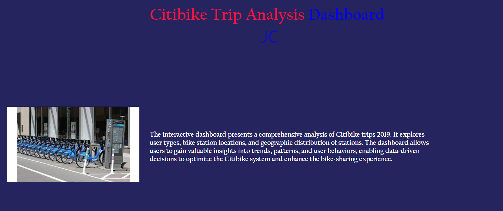
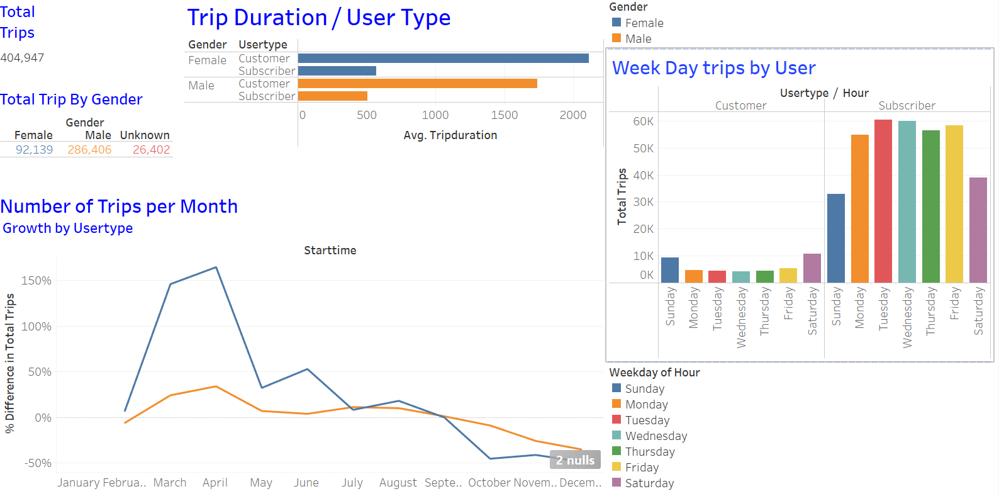
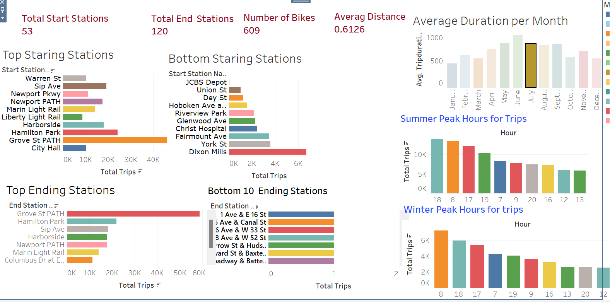
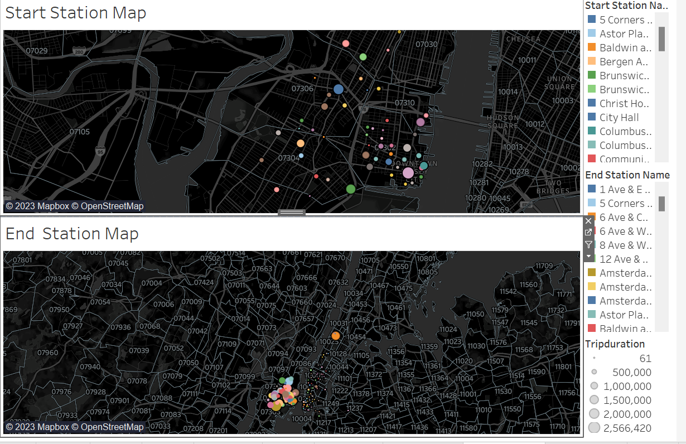

# Citi Bike Analysis with Tableau
https://public.tableau.com/app/profile/doaa.barqawi/viz/CitiBike1_16907732415930/Story1?publish=yes

Background

Congratulations on your new job! As the new lead analyst for the New York Citi Bike program, you are now responsible for overseeing the largest bike-sharing program in the United States. In your new role, you will be expected to generate regular reports for city officials looking to publicize and improve the city program.

Since 2013, the Citi Bike program has implemented a robust infrastructure for collecting data on the program's utilization. Each month, bike data is collected, organized, and made public on the Citi Bike Data webpage.

However, while the data has been regularly updated, the team has yet to implement a dashboard or sophisticated reporting process. City officials have questions about the program, so your first task on the job is to build a set of data reports to provide the answers.

Deployment

Please find below the link to the Tableau dashboard, showcasing the results of the analysis:
https://public.tableau.com/app/profile/doaa.barqawi/viz/CitiBike1_16907732415930/Story1?publish=yes

Data Source

The initial stage of the project involved acquiring all the monthly CSV files, covering the period from January 2019 to December 2019, from the Citi Bike Data webpage and organizing them in a designated folder named "data". The data used in this analysis specifically pertains to the Jersey City region.

Subsequently, I established a Jupyter Notebook file, named "citibike.ipynb", to systematically clean and combine all the monthly CSV files into a single CSV file, in preparation for importing into Tableau.

Dashboards

From the Citi Bike data, a homepage and three corresponding dashboards were created to provide a comprehensive analysis and visualization of the data.

Homepage

The homepage serves as an introduction to the project, providing a concise overview of its purpose and contents. It clearly summarizes the key insights and findings of each dashboard, allowing for quick and easy navigation.

User Analysis

The dashboard presents a comprehensive analysis of the Citi Bike trips, taking into account various factors such as user type, and Gender. Additionally, it provides an in-depth examination of trip patterns based week day , as well as the total number of trips per month.

Station Analysis

The dashboard focuses on the analysis of trips in relation to the bike stations. It shows the top 10 starting and ending  stations as well as 10  bottom stations , it also shows the summer and winter peak hours and Average Duration per month.

Geographic Analysis

The third dashboard features two maps showcasing the geographical locations of the start and end stations. The size and color of the markers are used to represent the total number of trips that originated or terminated at each station, providing a visual representation of the trip patterns and frequency.

A user-friendly interface has been created utilizing Tableau dashboards, allowing for seamless navigation between pages. Please access the link in the deployment section to explore the interactive dashboard and gain valuable insights.
