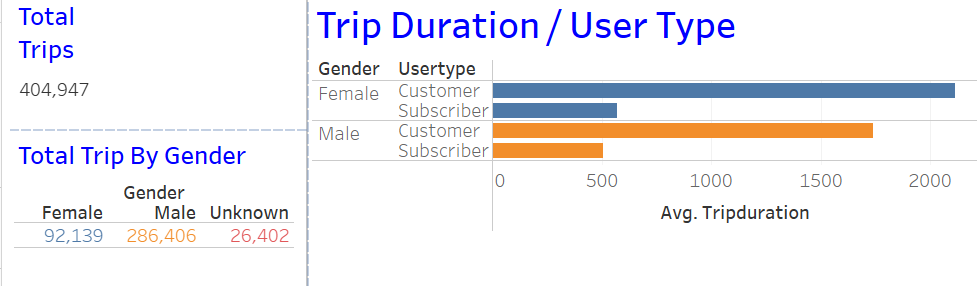
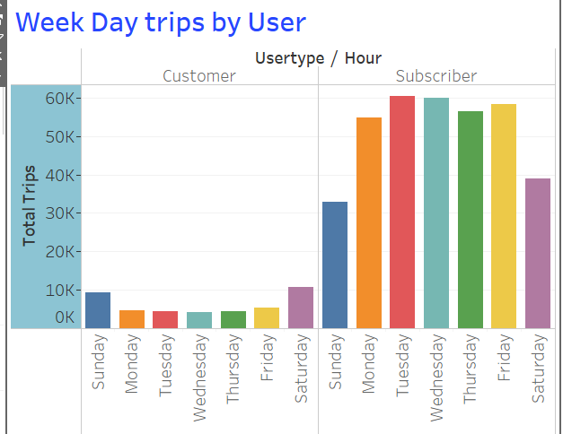
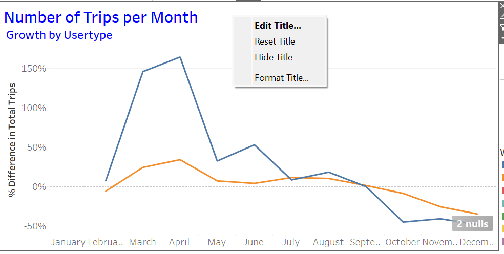
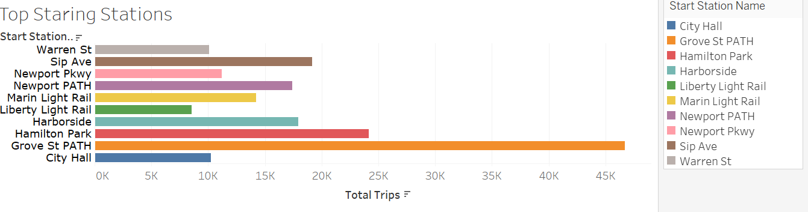
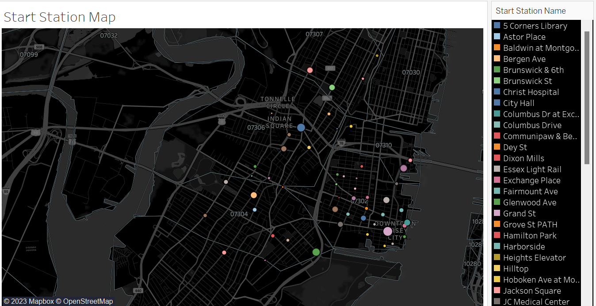
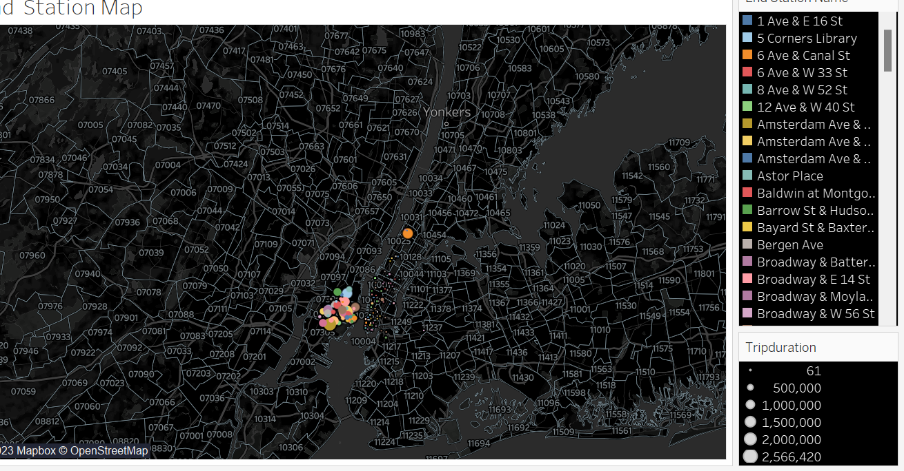

# Citi Bike Analysis with Tableau
https://public.tableau.com/app/profile/doaa.barqawi/viz/CitiBike1_16907732415930/Story1?publish=yes

Background
Congratulations on your new job! As the new lead analyst for the New York Citi Bike program, you are now responsible for overseeing the largest bike-sharing program in the United States. In your new role, you will be expected to generate regular reports for city officials looking to publicize and improve the city program.

Since 2013, the Citi Bike program has implemented a robust infrastructure for collecting data on the program's utilization. Each month, bike data is collected, organized, and made public on the Citi Bike Data webpage.

However, while the data has been regularly updated, the team has yet to implement a dashboard or sophisticated reporting process. City officials have questions about the program, so your first task on the job is to build a set of data reports to provide the answers.

Deployment
Please find below the link to the Tableau dashboard, showcasing the results of the analysis:
https://public.tableau.com/app/profile/doaa.barqawi/viz/CitiBike1_16907732415930/Story1?publish=yes

Data Source
The initial stage of the project involved acquiring all the monthly CSV files, covering the period from January 2019 to December 2019, from the Citi Bike Data webpage and organizing them in a designated folder named "data". The data used in this analysis specifically pertains to the Jersey City region.

Subsequently, I established a Jupyter Notebook file, named "citibike.ipynb", to systematically clean and combine all the monthly CSV files into a single CSV file, in preparation for importing into Tableau.

Dashboards
From the Citi Bike data, a homepage and three corresponding dashboards were created to provide a comprehensive analysis and visualization of the data.

Homepage
The homepage serves as an introduction to the project, providing a concise overview of its purpose and contents. It clearly summarizes the key insights and findings of each dashboard, allowing for quick and easy navigation.

User Analysis
The dashboard presents a comprehensive analysis of the Citi Bike trips, taking into account various factors such as user type, and Gender. Additionally, it provides an in-depth examination of trip patterns based week day , as well as the total number of trips per month.

Station Analysis
The dashboard focuses on the analysis of trips in relation to the bike stations. It shows the top 10 starting and ending  stations as well as 10  bottom stations , it also shows the summer and winter peak hours and Average Duration per month.

Geographic Analysis
The third dashboard features two maps showcasing the geographical locations of the start and end stations. The size and color of the markers are used to represent the total number of trips that originated or terminated at each station, providing a visual representation of the trip patterns and frequency.

A user-friendly interface has been created utilizing Tableau dashboards, allowing for seamless navigation between pages. Please access the link in the deployment section to explore the interactive dashboard and gain valuable insights.

Summarry 

An evaluation of the data covering the 2019 shows a total of 404,947  trips made using bicycles in New York City. 
number of female users was 92,139 and Male users are 286,406 .

An examination of the data reveals that the pattern of peak bicycle usage in New York City remained consistent during  2019, with the busiest periods occurring during the weekdays during comparing to weekends for subscriber users while its more busier during weekends  for the customer users.

April showing the bussiest month for subscribers comparing to the others months.

peak hours for the summer is evening hours and early morning when people going to work or school and drive back at the end of the day.

Winter peak hour is 8 am and then the evening hours follow.

The top statring station is Grove St Path 

An analysis of the start station map highlights the concentration of the most frequently used stations in Jersey City, New Jersey, primarily in the zip codes 07302 and 07310. This suggests that the residents of Jersey City utilize the bicycle-sharing service extensively, potentially due to its cost-effectiveness when compared to other transportation options, such as taxis and ride-sharing services.

Similar to the start station map, the end station map also illustrates a notable concentration of the most frequently used stations in Jersey City, New Jersey, indicating that residents are likely utilizing the bicycle-sharing service for their commutes to and from work.

Conclusion

In conclusion, this Tableau analysis provides a comprehensive overview of the trends and patterns in Citibike usage over a specified time period. Through the creation of interactive dashboards and visualizations, key insights have been extracted and presented, highlighting trends in user type and genderm  as well as trip patterns based on hours and weekdays. One noteworthy phenomenon observed from the overall analysis is the high usage of the Citibike service by residents of Jersey City, New Jersey, primarily for commuting purposes. This analysis serves as a valuable resource for anyone interested in understanding the usage of Citibike and exploring the data behind this popular bike-sharing service. I hope that this work will inspire further research and investigation into the data, and encourage others to build upon the insights presented her